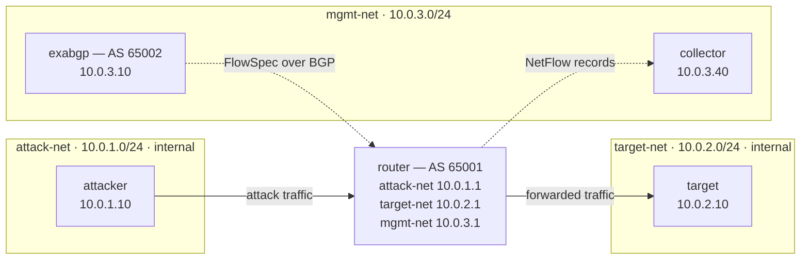

# DDoS & BGP FlowSpec Mitigation Lab

Five containers simulate traffic generation, routing, FlowSpec mitigation, and
NetFlow collection. The topology is defined in [docker-compose.yml](docker-compose.yml).

## Architecture

Solid arrows are the data plane; dotted arrows are control and telemetry.
Each box groups the containers that share a Docker bridge network.

| Container   | Role                                                                                             |
| ----------- | ------------------------------------------------------------------------------------------------ |
| `attacker`  | Generates traffic.                                                                               |
| `router`    | Routes and filters traffic between the attacker and target; exports metrics and NetFlow records. |
| `target`    | Receives traffic                                                                                 |
| `exabgp`    | Announces FlowSpec rules to the router over BGP.                                                 |
| `collector` | Receives NetFlow records from the router.                                                        |

`attack-net` and `target-net` are internal Docker networks. The attacker uses
`10.0.1.1` as its default gateway, and the target uses `10.0.2.1`, so traffic
between them passes through the router. Docker's bridge gateways use `.254`
on each subnet.
